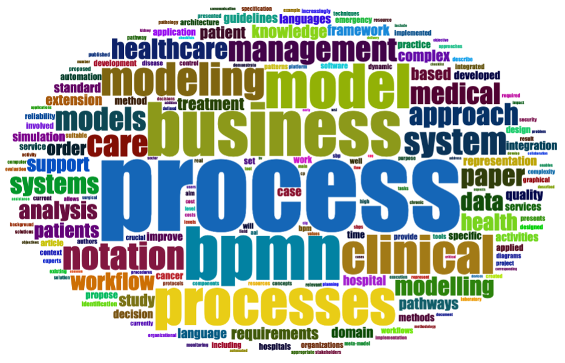

# **Is there a chance for clinicians, software developers, and business analysts to communicate more effectively?** 

In the context of healthcare, IT technologies are actively utilized helping to improve the quality of medical services. However, IT specialists working in the health sector yet are far from being done.

What are the health system challenges where the technology may help? According to WHO, they are as follows: 
*	insufficient supply of commodities
*	healthcare providers poor adherence to clinical guidelines
*	lack of access to information or data
*	loss to follow-up of clients

Various information systems had developed, and continue to be developing, to optimize and automize lots of processes in healthcare. Is health care a business? I am sure your answer is “yes”. So, the healthcare processes are business processes, right? 

Let’s imagine that we are in a hospital. For example, outpatient department. A patient, named Bob, plans to visit his GP. Very helpful and supportive receptionist Molly greets Bob and provides him a few forms to sign, in between calling Anna, a nurse. Then, Anna takes Bob to Doctor Brown’s office. To make the wait shorter, Anna collects some medical history, takes Bob’s temperature and blood pressure. Doctor Brown just finished with his previous patient and got ready for seeing Bob. Collecting signs and symptoms, Doctor Brown makes his decision on diagnosis and treatment. Just think up if I am continuing to describe how the doc makes his decision in the form of a narrow text. Medical decision-making is an extremely complicated process. Holy people are those who summarize and structure knowledge for developing clinical guidelines. 

Is there a clear border between business processes and clinical care pathways? By my reckoning, the processes are interlacing, one inside the other. Are the approaches used within the business context applicable for healthcare needs? 

Looking for the answer, I learned about an interesting community working on knowledge management and dissemination challenges in the healthcare sector. This is the Business Process Management in Health Workgroup (BPMHW) of the Object Management Group (OMG). In order to capture, structure, annotate and store guidelines and best approaches to practicing medicine, the group of experts works on the application of widely used in other industries standard languages – including Business Process Model and Notation (BPMN), Case Management Model and Notation (CMMN), and Decision Model and Notation (DMN) to healthcare systems. Collectively, the three standards (BPMN, CMMN, and DMN) are referred to as “BPM+”. 

## ***Who can benefit from BPM+ Health?***

There are three main categories of professionals that are involved in clinical workflow optimization and automation: 

*	healthcare professionals
*	business analysts
*	IT developers

So, medical processes should be *readable* and clear for all of them. In the form of narrative text, clinical pathway definitions can be interpreted in multiple variations. Possible? Certainly, particularly when there are lots of those crazy long medical terms. 

The BPMHW has published the Field Guide to Shareable Clinical Pathways. *“A handbook to help business analysts and knowledge engineers create models; clinical experts understand and validate models; and programmers and systems analysts implement the models”* – this is how they define the guide.

It makes sense to implement the effective approach that has been proved over a long period of time, in the new field. There are lots of professionals that can build models using OMG notations. Thus, there are enough hands to create a whole library of Shareable Clinical Pathways. Isn’t it awesome? 

## ***What about IT software vendors, how do they benefit from BPM+?*** 

Firstly, well-defined clinical pathways are capable to determine the data requirements necessary for interoperability among systems and healthcare organizations.

Furthermore, it’s crucial for software vendors to interpret the clinical pathways in the right way and to build software logic around those pathways. Electronic Health Records systems are designed to automate clinical workflows and allow access to evidence-based tools that providers can use to make decisions about a patient’s care. There are hundreds of vendors offering some type of EHR product. For your information, the approaches for software implementation of BPM+ Health are discussed among Process Automation & Enablement Working Group members bi-weekly.

To sum up, clinical workflow consists of very complex processes involving a number of diverse specialists. Processes modeling requires quite a lot of theoretical knowledge and experience from a developer in order to make a model overarching and accurate. However, when it comes to the BPM systems (BPMS), the current tendency is to develop low-code or even no-code platforms. Look at the vendors' websites: “Zero coding!”; “No programming skills needed!”.
What’s the catch?

It’s important not to confuse BPM, BPMS, BPMN, and BPM+ Health:
 
•	BPM – it’s an approach. The Association of Business Process Management Professionals defines BPM as:
Business process management (BPM) is a disciplined approach to identify, design, execute, document, measure, monitor, and control both automated and non-automated business processes to achieve consistent, targeted results aligned with an organization’s strategic goals.

Business processes description give an overview of the entire model of business enabling business analysts to compare the present state of the process and optimized future state (so-called AS-IS and TO-BE). Not all the processes can be optimized and automated!

•	BPMS – it’s software for business processes automation. Let’s say, a business analyst, Jackob, carries a gap analysis out; he determines which processes can be automated using IT technology. Your company’s IT specialists along with cool guys from a chosen software vendor company, integrate BPMS. In a graphic editor embedded in BPMS, either Jackob or your secretary Karina, using just a mouse and a keyboard, can implement the diagrams of business processes. Hello, low-code! Isn’t it cool?

•	BPMN – it is the notation, a graphical representation of business processes in a business model. The current version, BPMN 2.0, is widely used in various industries

•	BPM+ Health - these are standards, that “are backed by execution semantics, Shareable Clinical Pathways provide technological rigor yet are understandable by business analysts and healthcare professionals”, according to OMG Healthcare Domain Taskforce. In simple words, methodology for clinical pathway modeling

Have a look on utilization of BPM+ Health for representation of	[Alzheimer's disease patients care process](https://www.mdpi.com/2306-5729/5/1/16).

Have you ever dealt with the BPM approach or BPMN notation within the healthcare domain context?

## References
1. [The OMG managed community BPM+ Health](https://www.bpm-plus.org/)
2. [The Association of Business Process Management Professionals](https://www.abpmp.org/)
3. [The Standards Development Organization OMG](https://www.omg.org/oceb-2/)
4. [Tomaskova H, Kopecky M. Specialization of Business Process Model and Notation Applications in Medicine—A Review. Data. 2020; 5(4):99.](https://doi.org/10.3390/data5040099)
5. [Gomes J., Portela F. and Santos M. F. Introduction to BPM approach in Healthcare and Case Study of End User Interaction with EHR Interface Procedia Computer Science 2018; 141: 519-524](https://doi.org/10.1016/j.procs.2018.10.132)

